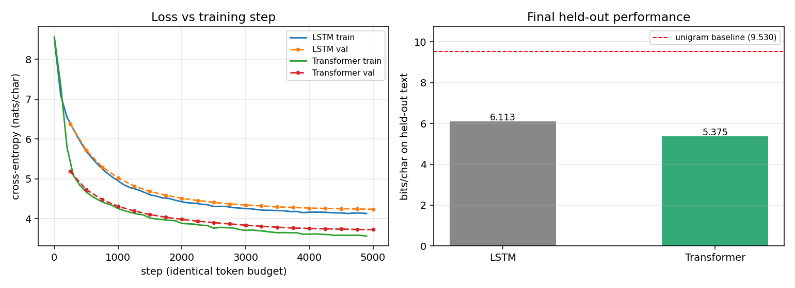

# From a hand-written LSTM to language models

Two character-level language models trained from scratch on the same 5.98M
characters of Chinese text, at matched parameter count and identical token
budget, so the architectures can be compared rather than just described.

| directory | model | parameters | held-out perplexity |
|---|---|---|---|
| [`lstm-lm/`](lstm-lm) | 2-layer LSTM, recurrence written by hand | 7,484,507 | 69.22 |
| [`transformer-lm/`](transformer-lm) | 6-layer causal Transformer | 7,313,755 | **41.49** |

Both are independent extensions completed in August 2026. Neither is graded
coursework — see below.

## Where this came from

CS324 Deep Learning (SUSTech, Fall 2024), Assignment 3 Part I required
implementing an LSTM from scratch, explicitly without `torch.nn.LSTM`, deriving
all four gates and unrolling the recurrence manually. That assignment trained
the network on `PalindromeDataset`: given the first T−1 digits of a digit
palindrome, predict the T-th. **The coursework itself is not published here** —
the assignment specification and my submission are available on request.

Its objective (equation 9 of the specification) computes cross-entropy at the
**final timestep only**:

```
L = - sum_k  y_k log( y~_k^(T) )          <- note the superscript (T)
```

The network reads a sequence, emits one label, and the intermediate hidden
states receive no supervision of their own. That is sequence classification.

A language model instead predicts the next token at **every** position:

```
L = - (1/T) sum_t sum_k  y_k^(t) log( y~_k^(t) )
```

One superscript is the entire boundary between the two. Crossing it is not a
local edit: a target at every step means real text rather than synthetic
labels, which means a vocabulary, which means an embedding table and an output
projection applied at every timestep. `lstm-lm/` is that crossing, keeping the
assignment's recurrence intact. `transformer-lm/` then replaces the recurrence
to see how much of the result was the objective and how much was the
architecture.

## LSTM vs. Causal Transformer

Held fixed across both runs: corpus, preprocessing, the 4,955-character
vocabulary built from the training split, the contiguous 98/2 split, sequence
length 128, effective batch 96, a budget of 5,000 × 96 × 128 = **61,440,000
training tokens**, the evaluation script and held-out text, the sampling
prompts, temperature 0.8, top-k 40, and seed 42.

```
$ python compare_models.py
```

| model | parameters | train tokens | wall time | val bpc | val ppl |
|---|---|---|---|---|---|
| LSTM | 7,484,507 | 61,440,000 | 25m58s | 6.113 | 69.22 |
| Transformer | 7,313,755 | 61,440,000 | **4m32s** | **5.375** | **41.49** |

| baseline (identical for both) | bits/char | perplexity |
|---|---|---|
| uniform over vocabulary | 12.275 | 4955.00 |
| unigram, fitted on train | 9.530 | 739.28 |
| unigram, oracle (entropy of val) | 9.393 | 672.25 |

| shuffle control | shuffled bits/char | penalty | gain over unigram |
|---|---|---|---|
| LSTM | 12.023 | 5.910 | 3.417 |
| Transformer | 12.908 | **7.533** | **4.155** |



**The Transformer achieved better held-out perplexity and better wall-clock
efficiency in this comparison**: 0.738 bits/char and 40.1% lower perplexity
with 2.3% fewer parameters, and 5.7x less wall clock. It passes the LSTM's
*final* validation loss at step 1,250 — a quarter of the budget.

**But almost none of the speed difference is architectural.** The trained LSTM
unrolls its recurrence in a Python loop while the Transformer calls a fused
attention kernel, so the 5.7x conflates architecture with implementation.
`benchmark_speed.py` separates them by adding cuDNN's fused `nn.LSTM` as a
third timing reference — used only for timing; the trained model does not use
it:

| implementation | ms/step | relative |
|---|---|---|
| LSTM, hand-written Python loop (the trained model) | 283.9 | 1.00x |
| LSTM, cuDNN fused `nn.LSTM` (reference only) | 45.8 | 6.20x |
| Transformer, fused SDPA (the trained model) | 42.3 | 6.72x |

Hand-written loop → fused LSTM is **6.2x**. Fused LSTM → Transformer is
**1.08x**. At this size and a 128-character sequence, a properly fused LSTM is
within about 8% of the Transformer; the wall-clock gap in the training runs is
overwhelmingly a kernel and implementation effect, not evidence that attention
is intrinsically faster here. The perplexity advantage is unaffected by any of
this — that one is real.

**The shuffle control is the more interesting result.** Shuffling the held-out
characters preserves the unigram distribution exactly and destroys only
ordering. It costs the Transformer 7.533 bits/char against the LSTM's 5.910 —
and pushes the Transformer *past* the uniform baseline, to 12.908 bits against
uniform's 12.275. On text whose ordering has been destroyed it is confidently
wrong rather than merely uninformed, because it is placing probability mass
according to sequential structure that is no longer there. Both models learned
ordering; the Transformer built a sharper and more committed model of it.

**What this does not show.** One seed each, one configuration each, no
hyperparameter sweep, no scaling curve. The learning rates differ (2e-3 for the
LSTM, 6e-4 for the Transformer) because each is a conventional default for its
architecture — so this compares two architectures at reasonable settings, not a
single variable. And "sequence length 128" means direct attention to all
earlier positions for one model and compression into a fixed-width cell state
for the other; the number is shared, the mechanism is not, and that is exactly
what is being measured. The direction of the result matches the published
literature, so it is unsurprising rather than novel. What it is, is controlled
on the axes that usually go uncontrolled.

## Reproducing

```bash
cd lstm-lm        && pip install -r requirements.txt && python train.py --corpus your_text.txt
cd ../transformer-lm && python train.py --corpus your_text.txt
cd .. && python compare_models.py
```

Corpus provenance, SHA-256 hashes and preprocessing: [`DATA.md`](DATA.md).

Each directory's README covers its own setup, and its REPORT.md the full
analysis. The corpus is not redistributed; `--corpus` accepts any UTF-8 text.

## Scope

These are 7.3–7.5M-parameter character-level models on 5.98M characters —
roughly four orders of magnitude below a modern language model, with no learned
subword tokenizer and no pretraining/finetuning split. They are an exercise in
the mechanics of language-model training: the next-token objective, perplexity
and bits-per-char, truncated BPTT, causal masking, autoregressive sampling, and
baselines and controls that survive being checked.
