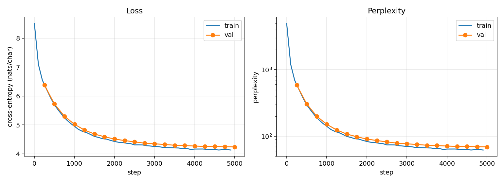

# Character-level LSTM Language Model — Report

Following the reporting format of the CS324 assignment this work extends:
model structure and experiment settings, experimental results with data and
diagrams, and analysis of those results.

---

## 1. Motivation

CS324 Assignment 3 Part I asked for an LSTM implemented from scratch, trained
on `PalindromeDataset`. Its objective (equation 9 of the assignment spec) is

```
L = - sum_k  y_k log( y~_k^(T) )
```

Cross-entropy at the **final timestep only**. The network reads a digit
sequence, emits one label, and the intermediate hidden states receive no
supervision of their own. That is sequence classification.

A language model instead predicts the next token at **every** position:

```
L = - (1/T) sum_t sum_k  y_k^(t) log( y~_k^(t) )
```

The single superscript is the entire distinction. This work crosses it, keeping
the same hand-written recurrence, and reports what happens.

Crossing it is not a local edit: requiring a target at every step means the
data must be real text rather than synthetic labels, which means a vocabulary,
which in turn requires an embedding table on the input side and an output
projection applied at every timestep rather than once at the end.

## 2. Model structure

### 2.1 The recurrence (unchanged from the assignment)

```
g_t = tanh   (W_gx x_t + W_gh h_{t-1} + b_g)
i_t = sigmoid(W_ix x_t + W_ih h_{t-1} + b_i)
f_t = sigmoid(W_fx x_t + W_fh h_{t-1} + b_f)
o_t = sigmoid(W_ox x_t + W_oh h_{t-1} + b_o)
c_t = g_t * i_t + c_{t-1} * f_t
h_t = tanh(c_t) * o_t
```

`torch.nn.LSTM` is not used. One implementation change was made for speed: the
assignment's eight `nn.Linear` layers are fused into two, `Wx: input -> 4H` and
`Wh: hidden -> 4H`, whose outputs are split with `chunk(4)`. Four independent
linear maps are equivalent to one map with four times the output width, so the
computation is identical; it is roughly 4x faster because it issues two matrix
multiplications per timestep instead of eight. Additionally `Wx` is applied to
the whole sequence outside the time loop, since `W_gx x_t` and its siblings do
not depend on `h_{t-1}`.

Forget-gate bias is initialised to 1.0 so that the cell state is retained
rather than erased during the first few hundred updates.

### 2.2 The language-model wrapper

| component | |
|---|---|
| Embedding | 4,955 -> 256 |
| LSTM | 2 layers, hidden 512, dropout 0.2 between layers |
| Output projection | 512 -> 4,955, applied at **every** timestep |
| Parameters | **7,484,507** |

`forward` returns logits of shape `(B, T, V)`; the `T` axis is where the change
of objective becomes physical. Hidden state is returned alongside so that
generation advances one character per step instead of re-running the prefix.

## 3. Experiment settings

| | |
|---|---|
| Corpus | 5,982,899 characters of Chinese news and literary text (17.7 MB UTF-8) |
| Vocabulary | 4,955 characters (min_freq = 2, rarer folded into `<unk>`) |
| Train / validation | contiguous 98% / 2% split, 119,658 held-out characters |
| Sequence length | 128 |
| Batch size | 96 |
| Optimiser | AdamW, β = (0.9, 0.95), weight decay 0.01 |
| Learning rate | 2e-3, cosine decay, 200 warmup steps |
| Gradient clipping | max-norm 1.0 |
| Precision | bf16 autocast |
| Steps | 5,000 (~61M characters seen, ~10 epochs) |
| Hardware | one RTX 5060 Laptop (8GB) |
| Wall clock | 25m58s |

Two data decisions are worth stating explicitly.

**Segmentation spaces are stripped.** The source corpus is word-segmented. Left
in, the space character would account for roughly 30% of all tokens and the
model would spend much of its capacity predicting word boundaries.

**The train/validation split is contiguous, not random.** Splitting *windows* at
random would place nearly every validation character inside some training
window, since windows are adjacent in the underlying text. The raw text is
therefore split first and windows built independently from each half.

## 4. Results

### 4.1 Training curve



| step | train ppl | val ppl | val bits/char |
|---|---|---|---|
| 0 | 4955.0 | — | 12.275 |
| 500 | 296.8 | 306.0 | 8.257 |
| 1000 | 141.1 | 151.3 | 7.241 |
| 2000 | 83.6 | 90.9 | 6.506 |
| 3000 | 70.4 | 77.0 | 6.266 |
| 4000 | 64.3 | 71.3 | 6.156 |
| 5000 | 62.2 (@4900) | **69.2** | **6.113** |

### 4.2 Comparison against baselines

Measured on held-out text with `eval.py`, 256-character context:

| | nats/char | bits/char | perplexity |
|---|---|---|---|
| uniform over vocabulary | 8.5082 | 12.275 | 4955.00 |
| unigram, fitted on train (add-1 smoothed) | 6.6057 | 9.530 | 739.28 |
| unigram, oracle (entropy of the val distribution) | 6.5106 | 9.393 | 672.25 |
| **this model** | **4.1665** | **6.011** | **64.49** |
| this model, on shuffled text | 8.3102 | 11.989 | 4065.07 |

Two unigram rows are reported because they bound the baseline from both sides.
The fitted row is what a unigram model actually achieves: probabilities
estimated on the training split and applied to held-out text. The oracle row is
the entropy of the validation distribution itself, which by Gibbs' inequality
is the lowest cross-entropy *any* unigram model could reach on this text — so
it is the stricter of the two. The model beats the fitted baseline by 3.52
bits/char and the oracle baseline by 3.38 bits/char.

### 4.3 Context-length ablation

Whether the model uses context beyond its 128-character training window was
tested directly, on identical target characters. Targets are predicted twice:
once at positions 128–255 of a 256-character window, and once at positions
0–127 of a fresh window beginning at the same offset. Same targets, same
weights, only the visible history differs.

| visible history | nats/char | bits/char | perplexity |
|---|---|---|---|
| ≥ 128 characters | 4.0120 | 5.788 | 55.26 |
| < 128 characters | 4.0460 | 5.837 | 57.17 |

The difference is **0.049 bits/char**, about 3% in perplexity, over 25,600
target characters.

### 4.3 Generated samples

Temperature 0.8, top-k 40. Corpus line breaks shown as ` / `.

**Step 1000:**
```
经济所有企业，是保持经济实发发放。/ 然为１９９７年中国人国的两个中国人民人员进行了一种一样。
```

**Step 3000:**
```
中国国家、华南方局都将不得地打击了，不同不断对人民和平与稳定。/ 中央军委的政治和
社会主义部门认为，我们应大的重要性。
```

**Step 5000:**
```
中国政府的有关责任。/ 据新华社伦敦１月１日电（记者黄建）在香港特区政府总理李岚清
（附图片１张）/ 李鹏说，《中国科学家，以上国科学家认为，是我国人才的工作”。
```

## 5. Analysis

**The initialisation is verifiably correct.** Training loss at step 0 is 8.5081
against a theoretical `ln(4955) = 8.5082`. A randomly initialised model should
be exactly as uncertain as a uniform prior over the vocabulary, and matching to
three decimal places is strong evidence that the forward pass, loss reduction,
vocabulary and data pipeline are all wired correctly. This check costs nothing
and is worth performing before trusting any later number.

**There is no meaningful overfitting.** Train and validation loss stay within
about 0.1 nats for the whole run, and the best checkpoint is the final one
rather than an early-stopped intermediate. At 7.5M parameters over 5.9M
training characters seen roughly ten times, overfitting would be the default
expectation; dropout 0.2 and weight decay 0.01 are sufficient to prevent it.
The curve is still descending at step 5000, so the run is compute-limited
rather than capacity-limited.

**The model has learned sequence, not frequency.** This is the claim the
unigram rows exist to test. A unigram model memorises which characters are
common and nothing else; this model beats the fitted version by **3.52
bits/char**, and still beats the oracle version — the best any unigram model
could do here — by **3.38 bits/char**. More decisively, shuffling the held-out
characters, an operation that preserves the unigram distribution exactly and
destroys only ordering, costs the model **5.98 bits/char** and returns it
almost to the uniform baseline. A model that had learned only character
frequencies would score both texts identically.

**Context beyond the training window helps, but only slightly.** The controlled
ablation in §4.3 puts the benefit of ≥128 characters of history at **0.049
bits/char** — real, but small. This is worth stating carefully, because the
uncontrolled version of the comparison is misleading: evaluating the same text
in 256-character windows rather than 128-character windows lowers perplexity
from 69.2 to 64.5, about 7%, which looks like a much larger long-range effect.
Most of that 7% is an artefact of which positions are being averaged. A
128-character window has every position at short history, while a 256-character
window has half its positions past 128 characters, so the two averages are
taken over different mixes of context length rather than over the same
predictions. Once the targets are held fixed, the effect shrinks to 0.049
bits/char. The cell state does carry information past the training window, but
the model is mostly operating on much shorter dependencies.

**What the samples show it learned.** Orthography first — essentially every
generated string is a legal character sequence. Then multi-character words and
proper nouns as units (`新华社`, `香港特区`, `社会主义市场`, `邓小平理论`),
paired delimiters (`“”`, `《》`, `（）`), and eventually template structure: the
news-wire dateline `据新华社 + place + date + 电（记者 + name）` is reproduced
correctly. Register is consistent — an `经济` prompt stays in economic
vocabulary for 200 characters.

**What it did not learn.** Factual grounding: `香港特区政府总理李岚清` is a
fluent string naming an office that does not exist. Coherence decays beyond a
sentence or two, and clauses do not agree with each other. The progression
across steps 1000 / 3000 / 5000 is informative here — surface form (punctuation,
date formats) is acquired first, then lexical chunks, then clause templates.
Semantics is not on that trajectory at this scale, and no sampling-parameter
tuning changes it.

## 6. Limitations

This is an LSTM at 7.5M parameters on 5.98M characters (17.7 MB of UTF-8):
roughly four orders of magnitude below a modern language model. Inputs are
characters rather than a learned subword tokenizer, there is no attention, and
this is a single training run — the context-length ablation above is the only
one, with no seed replicates, no hyperparameter sweep and no scaling curve.
Perplexity is not compared against any published benchmark, since the corpus is
not a standard one.

The intent is to exercise the mechanics of language-model training — the
next-token objective, perplexity and bits-per-char, truncated BPTT,
autoregressive sampling, and honest baselines — not to be competitive.

## 7. Reproducing

```bash
python train.py --max_steps 5000        # ~26 min on an RTX 5060 Laptop
python eval.py  --ckpt runs/best.pt
python sample.py --prompt "中国经济" --n 300 --temperature 0.8 --top_k 40
```

`runs/` contains the loss curve, `history.json` with per-step metrics, and
`samples.txt` logging generations throughout training. `train_log.txt` is the
full console log of the run described here.
