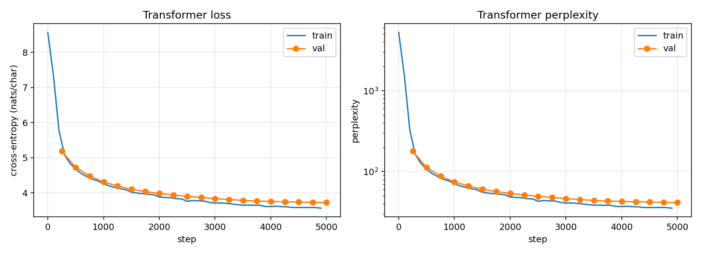

# Character-level causal Transformer — Report

A decoder-only Transformer trained under the same conditions as the LSTM in
`../lstm-lm`, at matched parameter count and identical token budget, so that
the two runs differ in architecture rather than in protocol.

Both are August 2026 independent extensions. Neither was part of the graded
CS324 coursework, which trained the LSTM on a synthetic digit-palindrome task.

---

## 1. What is held fixed

| | |
|---|---|
| Corpus | 5,982,899 characters of Chinese text (17.7 MB UTF-8) |
| Preprocessing | segmentation spaces stripped |
| Vocabulary | 4,955 characters, built from the training split, min_freq 2 |
| Split | contiguous 98% / 2%, 119,658 held-out characters |
| Sequence length | 128 |
| Effective batch | 96 |
| Token budget | 5,000 × 96 × 128 = **61,440,000** tokens |
| Evaluation | same script, same held-out text, full split, 128-character context |
| Sampling | same prompts, temperature 0.8, top-k 40 |
| Seed | 42 |

## 2. What differs

| | LSTM | Transformer |
|---|---|---|
| Architecture | 2 hand-written LSTM layers, hidden 512 | 6 pre-LN decoder blocks, d_model 256, 8 heads, d_ff 1024 |
| Parameters | 7,484,507 | 7,313,755 (−2.3%) |
| Positional information | implicit, through recurrence | learned positional embeddings |
| Learning rate | 2e-3 | 6e-4 |
| Dropout | 0.2 | 0.2 |

Two differences deserve to be named rather than glossed over.

**The learning rates are not the same.** 6e-4 is a conventional setting for a
Transformer of this size and 2e-3 for the LSTM; running both at one shared
value would handicap whichever architecture it suited less. So this is a
comparison of two architectures each at a reasonable setting, not a controlled
single-variable experiment. Neither learning rate was tuned against validation
results — both are defaults, kept as first written.

**"Sequence length 128" means different things.** For the Transformer every
position attends to all earlier positions in the window directly. For the LSTM
the same 128 characters must be compressed into a fixed-width cell state. The
number is shared; the mechanism is not. That difference is precisely what is
being measured.

## 3. Architecture

Decoder-only, blocks written out rather than via `nn.TransformerEncoder`. The
attention kernel is `F.scaled_dot_product_attention(..., is_causal=True)`.

```
token embedding (4955 -> 256) + learned positional embedding (128 -> 256)
6 x [ x + Attn(LayerNorm(x)) ; x + FFN(LayerNorm(x)) ]     # pre-LN
LayerNorm
Linear 256 -> 4955                                          # untied
```

FFN is `Linear(256, 1024) -> GELU -> Linear(1024, 256) -> Dropout`. No KV cache;
generation recomputes over the trailing 128 characters, which is adequate at
this scale and keeps the sampling path obviously correct.

**Causality was verified, not assumed.** Perturbing the token at position *t*
changes logits at positions ≥ *t* and leaves positions < *t* bit-identical
(max absolute difference 0.000e+00 across positions 0–63 when position 64 is
perturbed, and across 0–126 when position 127 is perturbed).

## 4. Results

### 4.1 Training

5,000 steps in **4m32s** on one RTX 5060 Laptop (8GB), against 25m58s for the
LSTM on the same budget — 5.7x. §5 shows that this gap is almost entirely an
implementation effect rather than an architectural one.

| step | train ppl | val ppl | val bits/char |
|---|---|---|---|
| 0 | 5235.0 | — | — |
| 250 | — | 178.48 | 7.480 |
| 1000 | 70.4 | 74.32 | 6.216 |
| 2000 | 48.4 | 53.71 | 5.747 |
| 3000 | 40.7 | 46.42 | 5.537 |
| 4000 | 37.0 | 42.76 | 5.418 |
| 5000 | 35.3 (@4900) | **41.49** | **5.375** |

Step-0 training loss is 8.5631 against `ln(4955) = 8.5082`. The small excess
comes from the randomly initialised output projection (normal, std 0.02), which
starts with slightly non-uniform logits — unlike the LSTM, whose head starts
closer to uniform and printed 8.5081. Close to the uniform prior is what this
check is for; exact agreement is not expected here.



### 4.2 Held-out evaluation

Full validation split, 128-character context:

| | nats/char | bits/char | perplexity |
|---|---|---|---|
| uniform over vocabulary | 8.5082 | 12.275 | 4955.00 |
| unigram, fitted on train (add-1 smoothed) | 6.6057 | 9.530 | 739.28 |
| unigram, oracle (entropy of the val distribution) | 6.5106 | 9.393 | 672.25 |
| **this model** | **3.7255** | **5.375** | **41.49** |
| this model, on shuffled text | 8.9472 | 12.908 | 7686.09 |

Gain over the train-fitted unigram baseline: **4.155 bits/char**. Penalty from
shuffling: **7.533 bits/char**.

### 4.3 Samples

Temperature 0.8, top-k 40, corpus line breaks shown as ` / `:

```
[中国] 中国的一大型企业的成功经营。/ 在"三个一条"的地方，中国家就是一个非洲经济的
       发展。/ 欧洲国家还在中国家采取了一系列措施，在１９９７年世贸易总额的同时，
       欧洲也同时也将保持其重要意义。
[经济] １９９７年，全县共有８００多个村，３８７户乡镇农民在１９９８年内实现利税收
       ３５０余万元。/ 据新华社北京７月２５日电湖北省政府将通过１９７年全县农户发放
       以来的优惠政策…
```

## 5. Analysis

**The Transformer achieved better held-out perplexity and better wall-clock
efficiency in this comparison.** 0.738 bits/char better, 40.1% lower
perplexity, at 2.3% fewer parameters and 5.7x less wall-clock time on an
identical token budget. The loss curves separate within the first 250 steps and
never re-cross; the Transformer passes the LSTM's *final* validation loss at
step 1,250 — a quarter of the budget, and under a minute of wall clock.

**Most of the speed difference is implementation, not architecture.** The
trained LSTM unrolls 128 timesteps in a Python loop; the Transformer calls a
fused attention kernel. Comparing only those two conflates "attention
parallelises over time" with "one of these runs a fused CUDA kernel".
`../benchmark_speed.py` adds cuDNN's fused `nn.LSTM` as a third timing
reference — same shape, used only for timing, not for any trained model:

| implementation | parameters | ms/step | median ratio |
|---|---|---|---|
| LSTM, hand-written Python loop (trained) | 7,484,507 | 316.3 ± 35.4 | 1.00x |
| LSTM, cuDNN fused `nn.LSTM` (reference) | 7,488,603 | 53.4 ± 8.4 | 5.92x |
| Transformer, fused SDPA (trained) | 7,313,755 | 52.5 ± 14.5 | 6.02x |

Batch 96 × sequence 128, bf16, 30 timed steps after 10 warmup, forward and
backward including the optimiser step, 5 rounds. Rounds are interleaved rather
than grouped: a laptop GPU throttles under sustained load, and grouping all
repeats of one model together charges whichever ran first for everyone else's
heat. An earlier grouped version of this benchmark produced a ±226 ms spread on
the hand-written model and ratio ranges spanning 4.6–12.8x, which is how the
problem surfaced.

Ratios taken within each round: hand-written loop → fused `nn.LSTM` is **5.99x**
(range 5.54–6.22); fused `nn.LSTM` → Transformer is **1.01x** (range
0.88–1.07). That range straddles 1.0 — in some rounds the Transformer was
slower — so the two fused implementations are not measurably different in speed
at this size.

This benchmark suggests that most of the observed wall-clock gap in these
implementations comes from kernel and implementation differences rather than
from architecture alone. It does not isolate architecture: `nn.LSTM` and SDPA
are two different optimised kernels, with different operator mixes and
different amounts of vendor tuning, so the second ratio is a comparison of two
fused implementations rather than a controlled measurement. The defensible
statement is that *this* LSTM implementation is slow because of its Python
recurrence, not that recurrence is inherently slow at 128 timesteps.

The perplexity result is untouched by any of this.

An earlier draft of this report attributed the wall-clock gap to attention
parallelising across the time dimension. That was wrong, and the benchmark
above is what showed it.

**It relies more on order, not less.** The shuffle control is the more
interesting result. Shuffling costs the Transformer 7.533 bits/char against the
LSTM's 5.910. On shuffled text the Transformer scores 12.908 bits/char — *worse
than the 12.275 bits of a uniform distribution*, meaning it is confidently
wrong rather than merely uninformed: it places probability mass according to
sequential structure that the shuffled text does not have. The LSTM degrades to
12.023 bits, essentially back to uniform. Both models learned ordering, but the
Transformer built a sharper and more committed model of it.

**A caveat on what this does and does not show.** This is one seed, one
hyperparameter setting per architecture, at 7.3–7.5M parameters on 6M
characters. It supports "a Transformer of this size, trained this way, on this
corpus, beat this LSTM decisively." It does not establish a scaling claim, and
with different learning rates it is not a single-variable experiment. The
direction of the result matches the published literature, which makes it
unsurprising rather than novel — the value here is that the comparison is
actually controlled on data, vocabulary, token budget and evaluation, which is
where informal architecture comparisons usually go wrong.

**A mechanism worth proposing but not claiming.** Every position in the
Transformer window reads earlier positions directly, while the LSTM must route
the same information through a fixed-width state updated 128 times. That is a
plausible account of the perplexity gap, but this experiment does not test it.

In particular, the LSTM's context-length ablation (`../lstm-lm/REPORT.md` §4.3)
found little additional gain beyond 128 characters — 0.049 bits/char. That is
consistent with limited use of longer history, but it measures behaviour
*outside* the 128-character window and therefore does not by itself explain a
difference measured *inside* the shared window. Attributing the gap to the
recurrent bottleneck would need a separate experiment: for example, per-position
loss curves within the window for both models, or an attention-span analysis.

## 6. Limitations

- One seed, one configuration each. No hyperparameter sweep, no scaling curve.
- Different learning rates, as discussed in §2.
- Character-level, not a learned subword tokenizer. No KV cache.
- 7.3M parameters on 6M characters is four orders of magnitude below a modern
  language model; nothing here should be read as a claim about large models.
- Perplexity is not compared against any published benchmark, since the corpus
  is not a standard one.

## 7. Reproducing

```bash
pip install -r requirements.txt
python train.py --corpus your_text.txt --max_steps 5000
python eval.py --ckpt runs/best.pt --seq_len 128 --max_windows 100000 \
    --save runs/eval_ctx128.json
python sample.py --prompt "中国经济" --n 300 --temperature 0.8 --top_k 40

cd .. && python compare_models.py
```
